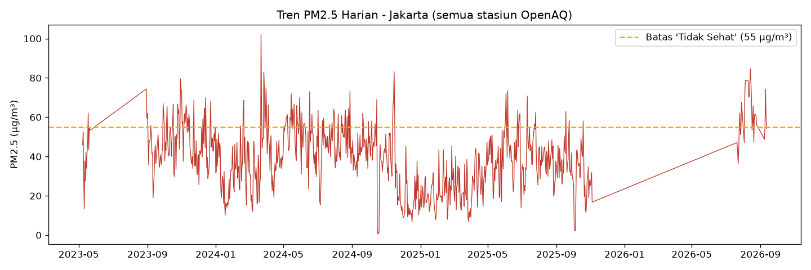
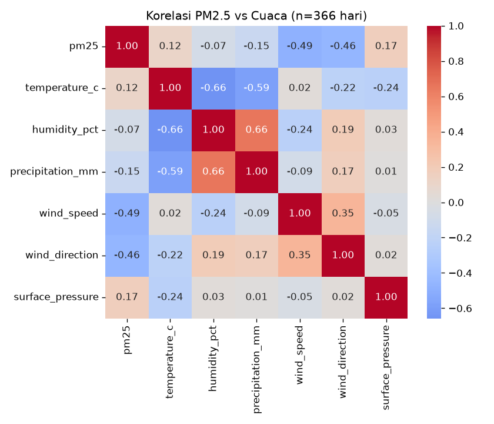
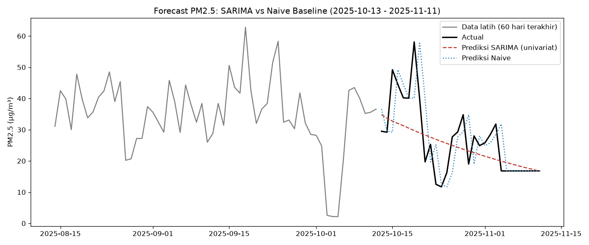
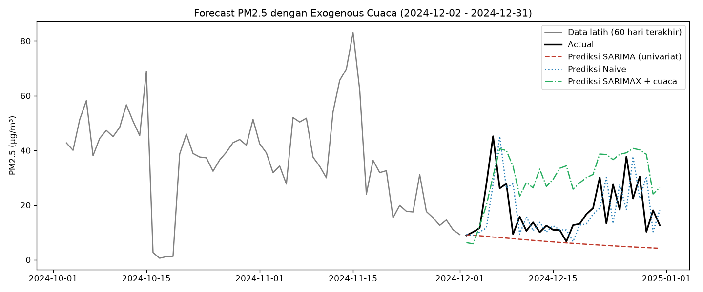

# Analisis & Forecasting Kualitas Udara Jakarta

Project data science: menggabungkan data kualitas udara (AQI), cuaca, dan
(nantinya) lalu lintas untuk mencari korelasi dan membangun model forecasting
AQI di Jakarta.

## Sumber Data

| Sumber | Data | API Key |
|---|---|---|
| [OpenAQ v3](https://docs.openaq.org) | PM2.5, PM10, O3, NO2, dll (per stasiun) | Ya (gratis, daftar di explore.openaq.org) |
| [Open-Meteo Archive](https://open-meteo.com/en/docs/historical-weather-api) | Suhu, kelembapan, angin, curah hujan (historis per jam) | Tidak |
| [BMKG](https://data.bmkg.go.id/prakiraan-cuaca/) | Prakiraan cuaca 3 hari ke depan (opsional) | Tidak |
| Traffic (belum diimplementasi) | TomTom Traffic Index / Google Mobility | Ya |

## Setup

```bash
python -m venv venv
source venv/bin/activate
pip install -r requirements.txt

export OPENAQ_API_KEY="api_key_kamu"
```

## Menjalankan Pengambilan Data

```bash
python fetch_openaq.py
python fetch_weather_openmeteo.py
python fetch_bmkg.py   # opsional
```

Output tersimpan di folder `data/`:
- `openaq_jakarta.csv`
- `weather_jakarta.csv`
- `bmkg_forecast_jakarta.csv`

## Hasil & Insight

Data mentah OpenAQ ternyata berasal dari banyak stasiun yang online di periode
berbeda-beda (2016, 2022, 2023, dst). Analisis difokuskan ke periode
**Sep 2023 – 2026** dimana beberapa stasiun (yang sekaligus mengukur PM2.5 dan
cuaca di lokasi yang sama) overlap, agar tren yang dianalisis representatif
untuk satu rentang waktu yang sama.

### Tren PM2.5 Harian



PM2.5 di Jakarta secara konsisten berosilasi di sekitar/atas ambang batas
"tidak sehat" (55 µg/m³ menurut standar AQI US EPA), dengan pola musiman yang
terlihat jelas.

### Korelasi dengan Cuaca



*(Update: korelasi dihitung ulang pakai data cuaca lengkap dari Open-Meteo,
bukan cuma sensor co-located yang datanya sedikit — hasilnya lebih robust.)*

| Variabel | Korelasi dengan PM2.5 |
|---|---|
| Kecepatan angin | -0.49 |
| Arah angin | -0.46 |
| Suhu permukaan | +0.17 |
| Curah hujan | -0.15 |
| Suhu | +0.12 |
| Kelembapan | -0.07 |

Insight: **kecepatan angin adalah faktor cuaca paling berpengaruh** terhadap
PM2.5 di Jakarta — masuk akal secara fisik, angin kencang membantu menyebarkan
polutan. Menariknya, saat dihitung dengan sampel yang lebih besar dan
representatif (366 hari penuh vs 670 hari dari sensor campuran sebelumnya),
korelasi dengan suhu/kelembapan jauh lebih lemah dari perkiraan awal — bukti
pentingnya kualitas & representativitas data, bukan cuma ukuran sampel.

### Forecasting PM2.5

**Model univariat** (SARIMA, tanpa variabel luar):



| Model | RMSE | MAE |
|---|---|---|
| Naive (nilai kemarin) | 9.16 | 6.17 |
| SARIMA(2,0,0)(1,0,0,7) | 9.30 | 7.07 |

**Model dengan exogenous cuaca** (SARIMAX, dievaluasi di Des 2024 — satu-satunya
periode dengan data cuaca lengkap yang tumpang tindih data PM2.5):



| Model | RMSE |
|---|---|
| Naive | 10.52 |
| SARIMA univariat | 15.04 |
| SARIMAX + cuaca | 15.86 |

**Temuan jujur**: baik SARIMA maupun SARIMAX+cuaca **belum mengalahkan** naive
baseline di kedua periode uji. Ini temuan yang umum untuk data polutan harian:
autokorelasi lag-1 sangat tinggi (nilai hari ini ≈ nilai kemarin), sehingga
baseline sederhana sulit dikalahkan pada horizon pendek (30 hari). Menambahkan
cuaca sebagai exogenous variable membuat model lebih responsif terhadap
perubahan tren (terlihat di plot, garis hijau lebih mengikuti pola naik-turun
dibanding SARIMA univariat yang cenderung datar), tapi belum cukup untuk
mengalahkan akurasi mentah si naive. Arah pengembangan berikutnya: coba model
berbasis pohon (XGBoost/LightGBM) dengan fitur lag + rolling window, yang
biasanya lebih baik menangani non-linearitas dibanding SARIMA/SARIMAX.

## Langkah Selanjutnya

1. **Coba XGBoost/LightGBM** dengan feature engineering (lag 1/7/14 hari,
   rolling mean, hari dalam seminggu) — kemungkinan lebih kuat dari SARIMA
   untuk data dengan hubungan non-linear seperti ini.
2. **Ambil data cuaca historis untuk 2023 & 2025** juga (bukan cuma 2024) dari
   Open-Meteo, biar overlap dengan data PM2.5 lebih panjang dan evaluasi
   SARIMAX lebih robust.
3. **Cari data traffic** — TomTom Traffic Index API (ada free tier) atau
   Google/Apple Mobility Report sebagai proxy.
4. **Dashboard Streamlit** untuk visualisasi live + hasil forecast.

## Catatan

- BMKG tidak menyediakan API resmi untuk data kualitas udara/AQI — untuk itu
  pakai OpenAQ atau data ISPU (https://ispu.menlhk.go.id).
- Radius pencarian stasiun OpenAQ default 15km dari Monas (`config.py`) —
  perbesar kalau hasilnya kosong/sedikit.
- Data OpenAQ berasal dari banyak stasiun dengan periode aktif berbeda-beda —
  selalu cek rentang tanggal per lokasi sebelum menganalisis (lihat
  `merge_data.py` untuk penanganannya).
